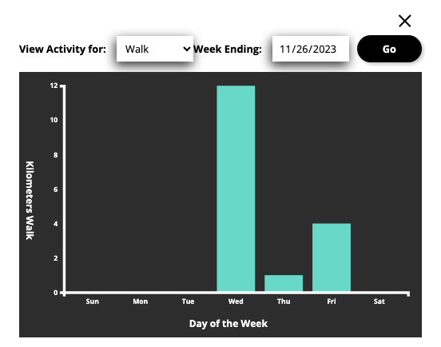

# Fitness App

A lightweight application that enables users to track various physical activites such as walks, bicycling, and swimming.

## Features

- Persisted Activity Tracking

- Visualization of user's physical activity

  

- Activity planning and reminders

- Responsive Design => Works on large desktops to small mobile phones and everything in-between

## Technologies

- Frontend
  - Javascript
  - CSS
  - D3
- Backend
  - NodeJS
  - ExpressJS
  - Sqlite
  - Passport
